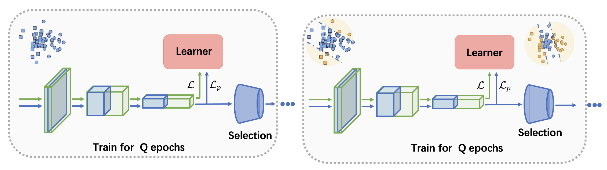

# DynaMS: Dyanmic Margin Selection for Efficient Deep Learning 

This repository contains the implementation of our paper ["DynaMS: Dyanmic Margin Selection for Efficient Deep Learning "](https://openreview.net/pdf?id=7oPAgqxNb20) in ICLR 2023.
We propose dynamic margin selection to accelerate training by dynamically pruning samples that are less imformative. (Coming soon, currently the implementation is under the compliance and security review process.)

An overall illustration is presented below:



## Dependencies
Our implementation is built on Python 3.6 with Pytorch. Install packages: 
```bash
pip install -r requirements.txt
```


## Execution 
### 1: Prepare datasets
Our experiments are based on CIFAR-10 and ImageNet-2012. Please first download the datasets yourself.
The default path to dataset is set to `--data_path TODO` in `./main.py`. Please change this in the following execution script correspondingly.

### 2: Training
The dynamic selection and training scripts are in `./scripts`.
* The default parameters for 0.6 budgets are set for each model in the scripts. 
* For Imagenet experiment, we use torch.distributed for parallel training. Make sure the number of GPU used matches `--nproc_per_node`. For example:
`python -u -m torch.distributed.launch --nproc_per_node=4 main.py  --gpu_id 0,1,2,3`
* The selection schedule affects the final performance, and the power schedule is hardcoded in the training scripts currently.

More descriptions of script args can be found in `./main.py`.


## Model Checkpoints & Training Logs
We also provide model checkpoints and training logs on CIFAR-10 and ImageNet datasets [here].
Note that the repository is minorly refacted from the original implementation in the paper, and the above procedures may not gaurantee to reproduce the same results due to searching randomness. 
However, the searched models are roughly close in general with similar accuracies.


## Citation
If you find this repo helpful for your research, please: 
```
@inproceedings{wang2023dynams,
  title={DynaMS: Dyanmic Margin Selection for Efficient Deep Learning},
  author={Wang, Jiaxing and Li, Yong and Zhuo, Jingwei and Shi, Xupeng and Zhang, Weizhong and Gong, Lixing and Tao, Tong and Liu, Pengzhang and Bao, Yongjun and Yan, Weipeng},
  booktitle={International Conference on Learning Representations}
  year={2023}
}

```

The implementation of margin selection is based on: 
```
@misc{emam2021active,
  title={Active Learning at the ImageNet Scale}, 
  author={Zeyad Ali Sami Emam and Hong-Min Chu and Ping-Yeh Chiang and Wojciech Czaja and Richard Leapman and Micah Goldblum and Tom Goldstein},
  year={2021},
  eprint={2111.12880},
  archivePrefix={arXiv},
  primaryClass={cs.CV}}
```
